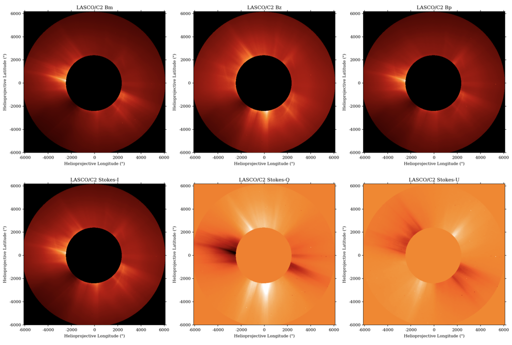

# solpolpy

`solpolpy` is a solar polarization resolver based on [Deforest et al. 2022](https://doi.org/10.3847/1538-4357/ac43b6).
It converts between various polarization formats, e.g. from the native three triple version from observations
(also known as the MZP convention) to polarization brightness (pB) and total brightness (B), Stokes I, Q and U, etc.

An example of transforming the polarization basis using the LASCO/C2 images is
shown in the image below.  The images at polarizing angles of -60°, 0° and +60° is shown in the top panel as
Bm, Bz and Bp respectively. The bottom panel shows the output of the `solpolpy` to convert the initial basis
to the Stokes I, Q and U.

## Quickstart
`pip install solpolpy`

We recommend following along the examples in [the documentation](https://solpolpy.readthedocs.io/en/latest/quickstart.html)!

## Getting Help
Please open a discussion or issue for help.

## Contributing
We encourage all contributions.
If you have a problem with the code or would like to see a new feature, please open an issue.
Or you can submit a pull request.

If you're contributing code, please see [this package's deveopment guide](https://solpolpy.readthedocs.io/en/latest/development.html).

## Code of Conduct
[Access here](CODE_OF_CONDUCT.md)

## Citing
To cite the software please cite the version you used with [the Zenodo citation](https://zenodo.org/records/10289143).

## Origin of the Name
`solpolpy` is just a combination of `sol` for solar, `pol` for polarization, and `py` for Python.
