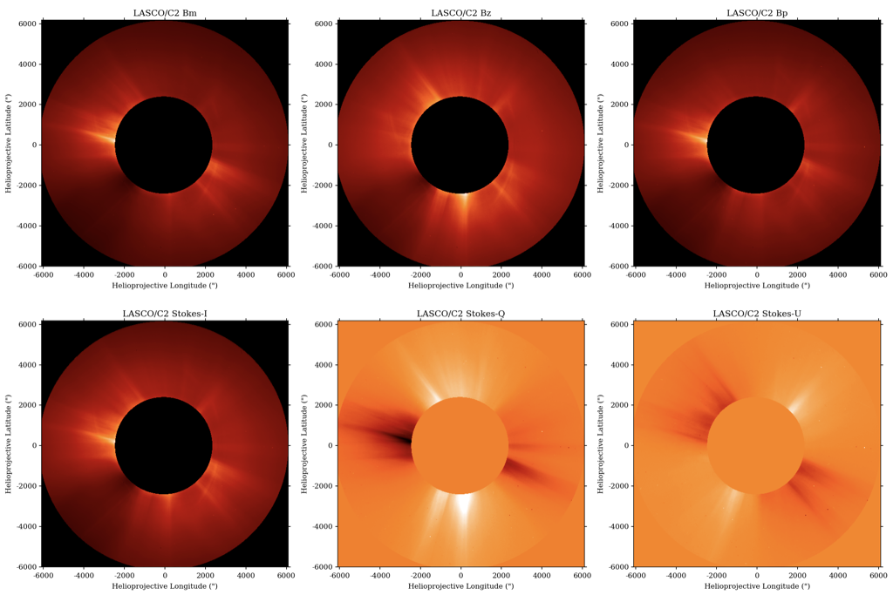

Welcome to solpolpy's documentation!
====================================

``solpolpy`` is an open-source Python package for transforming between
different polarization systems in solar physics and heliophysics.
It has been developed as part of the `PUNCH mission <https://github.com/punch-mission>`_.

An example of transforming the polarization basis using the LASCO/C2 images is shown in the image below.
The images at polarizing angles of -60°, 0° and +60° is shown in the top panel as Bm, Bz and Bp respectively.
The bottom panel shows the output of the solpolpy to convert the initial basis to the Stokes I, Q and U.

.. toctree::
   :maxdepth: 2
   :caption: Contents:

   quickstart
   example.ipynb
   help
   cite
   development

Indices and tables
------------------

* :ref:`genindex`
* :ref:`modindex`
* :ref:`search`
